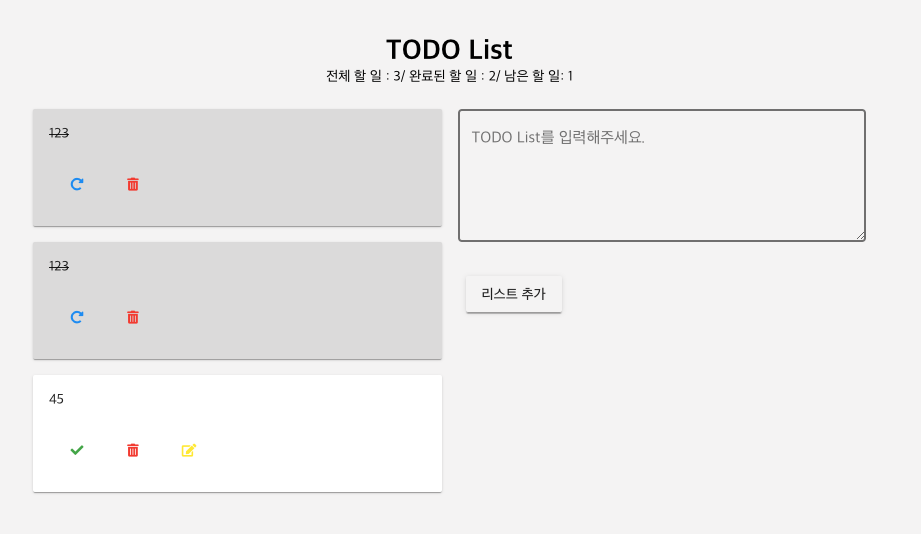

> vue cli proejct

### vue cli 3.0을 공부하면서 만들어 본 TODO List  
### vue cli, vuetify, props, emit, eventBus 등을 활용해 만들어 본 TODO List  

1. 할 일 추가
2. 할 일 완료
3. 할 일 삭제
4. 할 일 수정
5. 할 일 복구
6. 전체 할 일 갯수
7. 완료된 할 일 갯수
8. 남은 할 일 갯수

### npm install -> npm run serve

